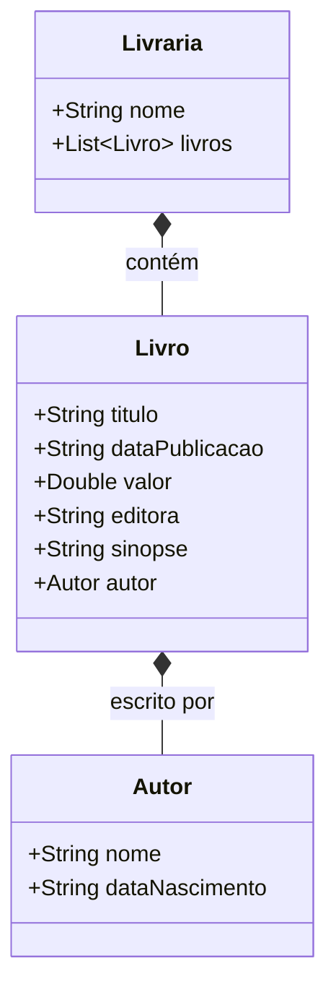

# Livraria simples
abstração de uma livraria com seus livros e autores

## Diagrama de classe

```mermaid
classDiagram
    class Livraria {
        +String nome
        +List~Livro~ livros
    }

    class Livro {
        +String titulo
        +String dataPublicacao
        +Double valor
        +String editora
        +String sinopse
        +Autor autor
    }

    class Autor {
        +String nome
        +String dataNascimento
    }

    Livraria *-- Livro : contém
    Livro *-- Autor : escrito por
```
